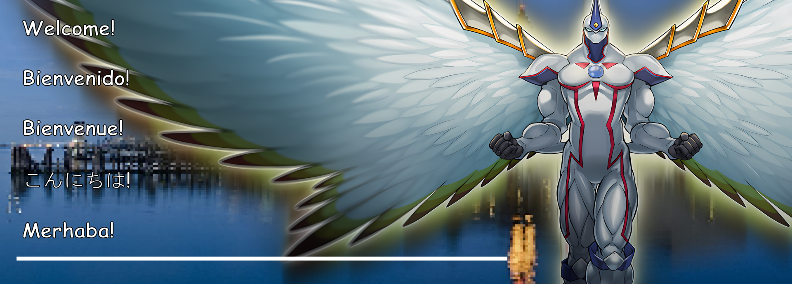

## 

<b>🇦🇺 | EN: </b>

Hi everyone, I’m Jimmy, a high school senior who is finally allowing his creativity to speak for itself. I love Japan and its culture; I love tech; I love football (⚽️), and I absolutely love broadening my horizons. I want to be an electrical engineer, and I hope to be based in Japan. This is my GitHub, and I hope you enjoy getting a look at my work firsthand. Every single repository here was worked on with my heart and soul, so I hope you all enjoy it as much as I do.

<b>🇪🇸 | ES: </b>

Hola a todos, soy Jimmy, un estudiante en su último año de secundaria que finalmente deja que su creatividad hable por él mismo. Me encanta Japón y su cultura; me encanta tech; me encanta futbol; y sí que me encanta

<b>🇫🇷 | FR: </b>

Bonjour tous les mondes, je suis Jimmy

<table>
  <tr>
    <td width="50%" valign="top">
      

        
<b>🇦🇺 | EN: </b>

        Hi everyone, I’m Jimmy, a high school senior who is finally allowing his creativity to speak for itself. I love Japan and its culture; I love tech; I love football (⚽️), and I absolutely love broadening my horizons. I want to be an electrical engineer, and I hope to be based in Japan. This is my GitHub, and I hope you enjoy getting a look at my work firsthand. Every single repository here was worked on with my heart and soul, so I hope you all enjoy it as much as I do.
        

  

    
<b>🇪🇸 | ES: </b>

    Hola a todos, soy Jimmy, un estudiante en su último año de secundaria que finalmente deja que su creatividad hable por él mismo. Me encanta Japón y su cultura; me encanta tech; me encanta futbol; y sí que me encanta
    

  

    
<b>🇫🇷 | FR: </b>

    Bonjour tous les mondes, je suis Jimmy
    

    </td>
    <td width="50%" valign="top">
    <b> Programming Languages: </b> 
Hi everyone, I’m Jimmy, a high school senior who is finally allowing his creativity to speak for itself. I love Japan and its culture; I love tech; I love football (⚽️), and I absolutely love broadening my horizons. I want to be an electrical engineer, and I hope to be based in Japan. This is my GitHub, and I hope you enjoy getting a look at my work firsthand. Every single repository here was worked on with my heart and soul, so I hope you all enjoy it as much as I do.
  </td>
  </tr>
</table>

<!--
**jub2009/jub2009** is a ✨ _special_ ✨ repository because its `README.md` (this file) appears on your GitHub profile.

Here are some ideas to get you started:

- 🔭 I’m currently working on ...
- 🌱 I’m currently learning ...
- 👯 I’m looking to collaborate on ...
- 🤔 I’m looking for help with ...
- 💬 Ask me about ...
- 📫 How to reach me: ...
- 😄 Pronouns: ...
- ⚡ Fun fact: ...
-->
